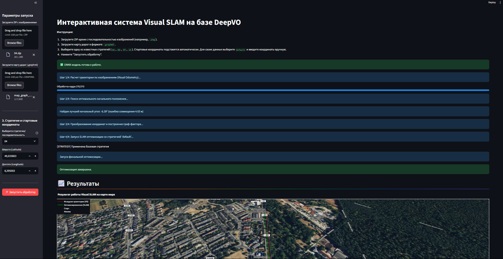
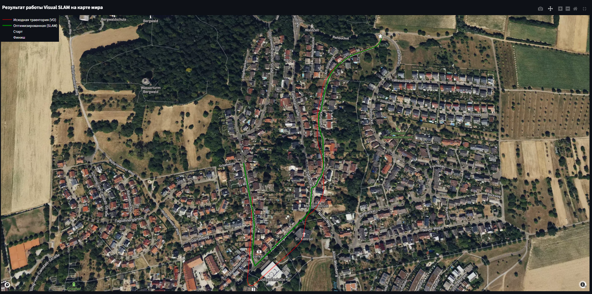
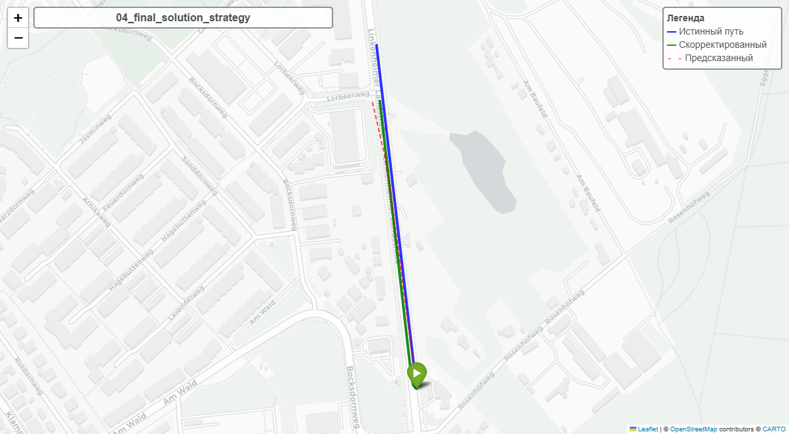
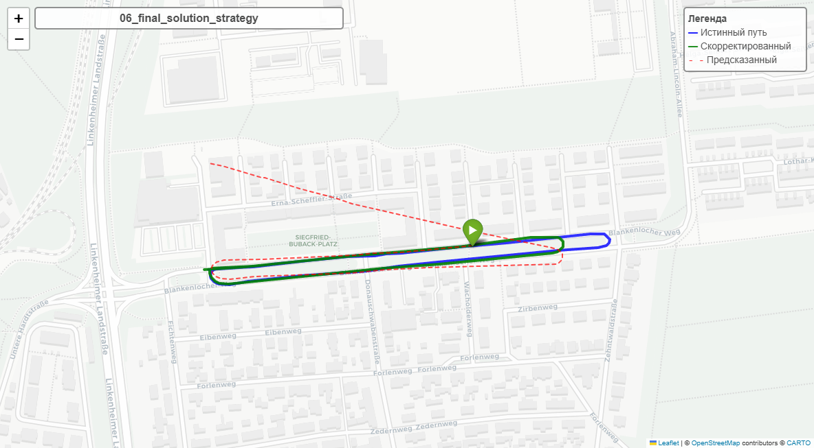
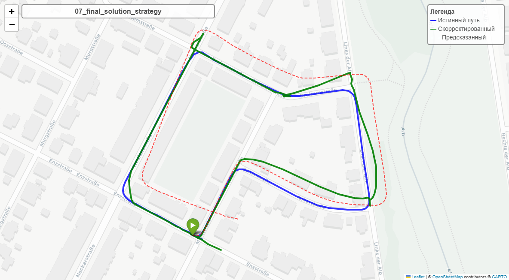
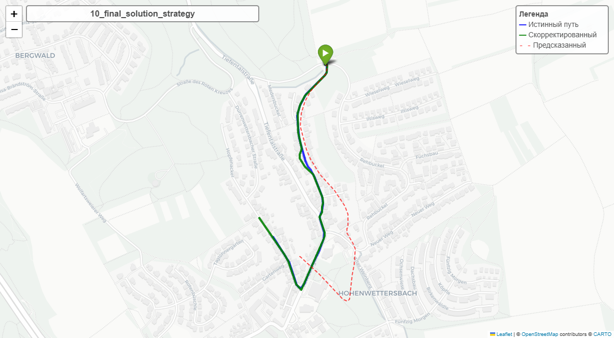

# DeepVO: Visual-Inertial SLAM System

Система визуально-инерциальной SLAM на основе глубокого обучения для восстановления пути движения по видеопотоку и картам дорог. Задача состояла в восстановлении траектории движения, имея только видеопоследовательность изображений KITTI, карты дорог и начальную точку - других датчиков в системе не используется.

## Описание

DeepVO - это система для оценки визуальной одометрии, которая объединяет:
- **CNN для извлечения признаков** на основе предобученной FlowNet
- **RNN (LSTM) для временного моделирования** движения камеры
- **GTSAM для оптимизации графа** для улучшения траектории
- **Привязку к карте дорог** для коррекции траектории

## Особенности

- ✅ Обучение с нуля и fine-tuning предобученных моделей
- ✅ Поддержка различных стратегий для разных последовательностей KITTI
- ✅ Интеграция с картами дорог OpenStreetMap
- ✅ Визуализация результатов в интерактивных картах
- ✅ Полная оценка качества траекторий

## Демонстрация и запуск

Проект можно запустить двумя способами: через интерактивный веб-интерфейс (рекомендуется для демонстрации) или через Docker (рекомендуется для установки).

### 1. Интерактивная демонстрация (Streamlit)

Проект включает веб-приложение на базе Streamlit (`app.py`), которое позволяет запускать SLAM-пайплайн в удобном интерфейсе без использования командной строки.

**Запуск:**
```bash
# Убедитесь, что вы находитесь в среде с установленными зависимостями
streamlit run app.py
````

Интерфейс позволяет загрузить ZIP-архив с изображениями, файл карты `.graphml`, выбрать стратегию и получить результат на интерактивной карте мира.




### 2\. Запуск через Docker

Docker полностью автоматизирует сложную установку зависимостей, таких как GTSAM, и гарантирует запуск в идентичной среде.

**Требования:**

  - Установленный Docker Desktop.

**Инструкция:**

1.  **Соберите Docker-образ:**
    команда создаст образ с именем `deepvo-slam-app`. Первая сборка займет 20-30 минут.
    ```bash
    docker build -t deepvo-slam-app .
    ```
2.  **Запустите контейнер:**
    эта команда запустит веб-приложение. Также для демонстрации на реальной карте нужен бесплтаный API ключ с mapbox.com, который нужно указать в secrets.toml
    ```bash
    docker run -p 8501:8501 --rm -v "$(pwd)/.streamlit:/app/.streamlit" deepvo-slam-app
    ```
3.  **Откройте приложение:**
    перейдите в браузере по адресу **http://localhost:8501**.

## Структура проекта

```
DeepVO/
├── deepvo/                   # Основной пакет Python (SLAM, модели, утилиты)
├── configs/                  # Конфигурационные файлы
├── dataset/                  # Данные KITTI: poses/ (gt и npy), sequences/ (изображения)
├── map_graphs/               # Графы дорог для map-matching (используются SLAM)
├── ground_truth_generated/ # Сгенерированные ground truth траектории для сравнения
├── experiments/              # Веса моделей и логи обучения
├── notebooks/                # Jupyter ноутбук с обучением
├── fig/                      # Примеры визуализации результатов (png, html)
├── tools/                    # Вспомогательные утилиты (трансформации, оценка поз)
├── utils/                    # Препроцессинг, утилиты для данных
├── scripts/                  # Скрипты для запуска отдельных этапов
├── examples/                 # Примеры запуска SLAM
├── tests/                    # Тесты
├── FINAL_SLAM_FULL.py        # Главный SLAM модуль (основной файл)
├── app.py                    # Стримлинт
├── train.py                  # Скрипт обучения
├── requirements.txt          # Зависимости проекта
├── pyproject.toml            # Современная конфигурация Python проекта
├── setup.py                  # Классический setup файл
└── README.md                 # Документация
```

### Описание ключевых папок

  - `map_graphs/` — содержит .graphml файлы для каждой последовательности KITTI, используется для map-matching (привязка траектории к карте дорог).
  - `ground_truth_generated/` — содержит txt-файлы с эталонными траекториями для оценки качества.
  - `notebooks/` — обучение модели.
  - `fig/` — PNG/HTML с примерами финальных траекторий и визуализаций.
  - `experiments/` — веса моделей и логи (большие файлы не хранить в git, только структура).

## Запуск вне докера для тестирования отдельных модулей

### 1\. Препроцессинг данных

Перед обучением необходимо подготовить относительные позы:

```bash
python utils/preprocess.py
```

### 2\. Установка зависимостей

```bash
pip install -r requirements.txt
```

### 3\. Обучение модели

```bash
# Обучение с нуля
python train.py

# Fine-tuning предобученной модели
python train.py --fine_tune
```

### 4\. Запуск SLAM

```bash
# Запуск для последовательности 04 (по умолчанию)
python FINAL_SLAM_FULL.py

# Запуск для конкретной последовательности
python FINAL_SLAM_FULL.py --sequence 06
python FINAL_SLAM_FULL.py -s 07
python FINAL_SLAM_FULL.py -s 10
```

## Примеры результатов (fig/)

В папке `fig/` содержатся примеры визуализации финальных траекторий для разных последовательностей:

- map_04_final_solution_strategy.png
- map_06_final_solution_strategy.png
- map_07_final_solution_strategy.png
- map_10_final_solution_strategy.png






## Поддерживаемые последовательности

**Система протестирована и оптимизирована для последовательностей:**

  - **04** - базовая последовательность (по умолчанию)
  - **06** - сложные повороты (специальная стратегия)
  - **07** - агрессивная стратегия с фильтрацией дорог
  - **10** - генерация пути со сложной графовой логикой

Каждая последовательность использует индивидуально настроенную стратегию оптимизации.

## Требования

  - Python 3.7+
  - PyTorch 1.8+
  - GTSAM 4.0+ (см. [GTSAM\_INSTALL.md](https://www.google.com/search?q=GTSAM_INSTALL.md))
  - OpenCV
  - NetworkX
  - Shapely
  - Folium

## О pyproject.toml

`pyproject.toml` - это современный стандарт конфигурации Python проектов (PEP 518/621), который заменяет классический `setup.py`. Он содержит:

  - Метаданные проекта (название, версия, авторы)
  - Зависимости и их версии
  - Настройки инструментов разработки (black, pytest, mypy)
  - Конфигурацию сборки пакета

Этот файл позволяет легко устанавливать проект командой `pip install .` и публиковать в PyPI.

## Датасет KITTI

Проект использует датасет KITTI Odometry:

  - **Обучение:** 00, 02, 08, 09
  - **Валидация:** 03, 05
  - **Тестирование:** 04, 06, 07, 10 ← **Только эти последовательности поддерживаются**

## Подготовка

1.  Скачайте датасет KITTI Odometry (см. ниже).
2.  Скачайте pre-trained модель FlowNetS: [flownets\_bn\_EPE2.459.pth](https://drive.google.com/drive/folders/16eo3p9dO_vmssxRoZCmWkTpNjKRzJzn5) и поместите в папку `models/`.
3.  Скачайте модель DeepVO: [t00020809\_v030405060710\_im192x640\_s7\_b12\_finetuned.model.latest](https://drive.google.com/file/d/1naUObfVAK2xbpECZ3h6clZ-b8YI2ooln/view?usp=sharing) и поместите в папку `experiments/kitti_finetuned/models/`.

### Загрузка данных

Датасет KITTI не включен в репозиторий из-за большого размера (\~66GB). Для работы с проектом:

1.  **Скачайте KITTI Odometry dataset с официального сайта:**

    Перейдите на официальную страницу KITTI Odometry: https://www.cvlibs.net/datasets/kitti/eval\_odometry.php

    Загрузите следующие файлы:

      - **Color images** (65 GB) - цветные изображения для одометрии
      - **Ground truth poses** (4 MB) - данные истинной траектории
      - **Calibration files** (1 MB) - файлы калибровки камер

2.  **Распакуйте в папку `dataset/`:**

    ```bash
    # Создайте структуру папок
    mkdir -p dataset/sequences dataset/poses

    # Распакуйте данные в соответствующие папки
    unzip data_odometry_color.zip -d dataset/
    unzip data_odometry_poses.zip -d dataset/
    unzip data_odometry_calib.zip -d dataset/
    ```

3.  **Структура должна быть:**

    ```
    dataset/
    ├── sequences/
    │    ├── 00/
    │    ├── 01/
    │    └── ...
    └── poses/
         ├── 00.txt
         ├── 01.txt
         └── ...
    ```

## Результаты

Система достигает высокой точности на тестовых последовательностях KITTI благодаря:

  - Индивидуальным стратегиям для каждой последовательности
  - Оптимизации графа факторов GTSAM
  - Привязке к картам дорог OpenStreetMap

## Цитирование

```bibtex
@misc{deepvo2025,
     title={DeepVO: Visual-Inertial SLAM System},
     author={Andrew Korchemkin},
     year={2025},
     url={https://github.com/aak204/deepvo-slam.git},
     note={KITTI-optimized SLAM implementation}
}
```

## Лицензия

MIT License - см. файл LICENSE для подробностей.
